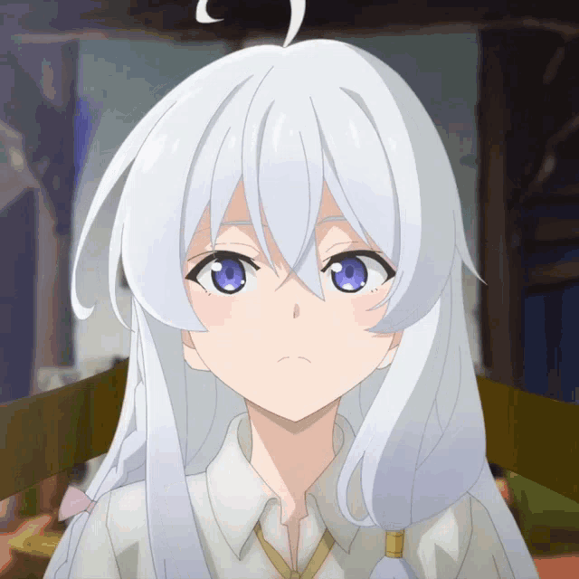

    

    
    
    
    

## Tentang Laravel

Laravel adalah kerangka kerja aplikasi web dengan sintaks yang ekspresif dan elegan. Kami percaya pengembangan harus menjadi pengalaman yang menyenangkan dan kreatif untuk benar-benar memuaskan. Laravel menghilangkan rasa sakit dalam pengembangan dengan mempermudah tugas-tugas umum yang digunakan dalam banyak proyek web, seperti:

- 

Laravel dapat diakses, kuat, dan menyediakan alat yang diperlukan untuk aplikasi besar dan kokoh.

## Belajar Laravel

Laravel memiliki [dokumentasi](https://laravel.com/docs) dan perpustakaan tutorial video yang paling luas dan komprehensif dari semua kerangka kerja aplikasi web modern, membuatnya mudah untuk memulai dengan kerangka kerja.

Anda juga dapat mencoba [Laravel Bootcamp](https://bootcamp.laravel.com), di mana Anda akan dipandu melalui pembangunan aplikasi Laravel modern dari awal.

Jika Anda tidak ingin membaca, [Laracasts](https://laracasts.com) bisa membantu. Laracasts berisi ribuan tutorial video tentang berbagai topik termasuk Laravel, PHP modern, pengujian unit, dan JavaScript. Tingkatkan keterampilan Anda dengan menjelajahi perpustakaan video kami yang komprehensif.

## Sponsor Laravel

Kami ingin mengucapkan terima kasih kepada sponsor berikut yang telah mendanai pengembangan Laravel. Jika Anda tertarik untuk menjadi sponsor, silakan kunjungi [program Mitra Laravel](https://partners.laravel.com).

### Mitra Premium

- **[Vehikl](https://vehikl.com/)**
- **[Tighten Co.](https://tighten.co)**
- **[WebReinvent](https://webreinvent.com/)**
- **[Kirschbaum Development Group](https://kirschbaumdevelopment.com)**
- **[64 Robots](https://64robots.com)**
- **[Curotec](https://www.curotec.com/services/technologies/laravel/)**
- **[Cyber-Duck](https://cyber-duck.co.uk)**
- **[DevSquad](https://devsquad.com/hire-laravel-developers)**
- **[Jump24](https://jump24.co.uk)**
- **[Redberry](https://redberry.international/laravel/)**
- **[Active Logic](https://activelogic.com)**
- **[byte5](https://byte5.de)**
- **[OP.GG](https://op.gg)**

## Berkontribusi

Terima kasih telah mempertimbangkan untuk berkontribusi pada kerangka kerja Laravel! Panduan kontribusi dapat ditemukan di [dokumentasi Laravel](https://laravel.com/docs/contributions).

## Kode Etik

Untuk memastikan bahwa komunitas Laravel bersahabat bagi semua, harap tinjau dan patuhi [Kode Etik](https://laravel.com/docs/contributions#code-of-conduct).

## Kerentanan Keamanan

Jika Anda menemukan kerentanan keamanan dalam Laravel, silakan kirim surel ke Taylor Otwell melalui [taylor@laravel.com](mailto:taylor@laravel.com). Semua kerentanan keamanan akan segera ditangani.

## Lisensi

Kerangka kerja Laravel adalah perangkat lunak sumber terbuka yang dilisensikan di bawah [lisensi MIT](https://opensource.org/licenses/MIT).
